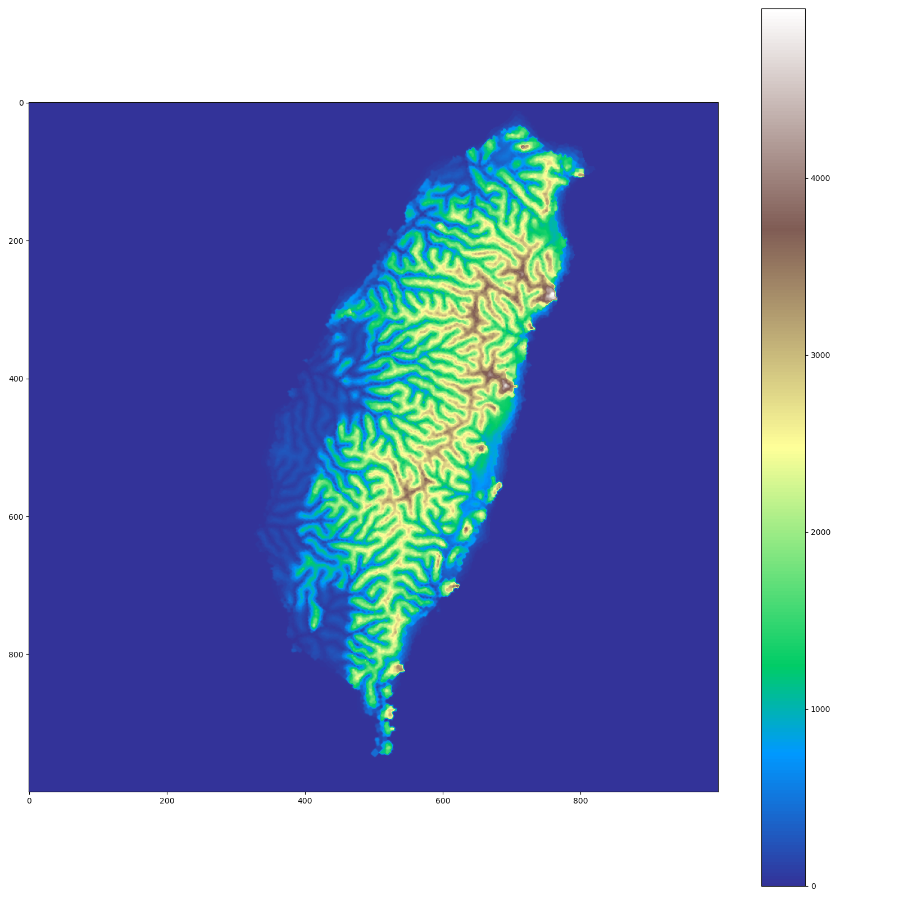

# terrainHydrology

This is a terrain generator inspired by 2013 paper "Terrain Generation Using Procedural Models Based on Hydrology".



## About

Most ontogenetic approaches to procedural terrain (Perlin noise, midpoint displacement, etc) produce results that, although generally better than man-made maps, are nonetheless unnatural. Real terrain contains very few local minima, and is not evenly fractal at all scales. Teleological algorithms can help, but may not be performant, especially when simulating small-scale processes over large maps.

The approach described in Genevaux et al is an ontogenetic approach that is meant to more closely approximate features of terrain on a sub-regional scale. On this scale, terrain is strongly shaped by the flow of water---even in dry landscapes. Thus, the approach of this algorithm is to generate the hydrological network first, and then generate terrain features from that. The approach is reasonably fast (or, at least, it can be) compared to an equivalent teleological approach, and the results are fairly convincing. Moreover, the user is allowed a great deal of control over the output by controlling the shoreline and the slope of rivers and the surrounding terrain.

## Usage

`hydrology.py` is located in the `src/` directory. The `-h` switch will display the basic options.

### Input

The program requires three images as inputs. They should all be the same resolution.

1. The gamma, or shoreline, should be a black-and-white image (though the actual color model does not matter). Full white `ffffff` represents land, and full black `000000` represents ocean. The program does not currently support inland seas or lakes.
1. The river slope map is a grayscale image (though the actual color model does not matter). This map indicates the slope of rivers. Lighter values represent steeper slopes, and darker values represent more level slopes.
1. The terrain slope map is also a grayscale image. It indicates the slope of terrain independent of the rivers.

### Output

A directory must be specified where the script will dump all of its output.

There are two outputs that will be useful to users. Firstly, `out-color.png` is a human-friendly elevation map. Secondly, `out.tif` is a GeoTIFF that can be read by GIS software. To adjust the location that the GeoTIFF specifies, edit the `projection` string on line 610.

As this program is in the early stages of development, it produces a number of charts and figures which are helpful for debugging. The final results are written to `out.png` and `out-color.png`. All these files will be placed in the output directory.

### Example

```
src/hydrology.py -g example/in/gamma.png -r example/in/riverslope.png -t example/in/terrainslope.png -o example/out/
```

## Documentation

Documentation for developers and "power users" can be found in the `doc` directory. Documentation is powered by Sphinx.

To generate the documentation, install Sphinx and run

> make html

or

> make pdf

To generate pdf documentation, you will need the LaTeX toolchain.

## Dependencies and citations

Poisson.py is a modified version of the Possion.py in this repository:

> [https://github.com/bartwronski/PoissonSamplingGenerator](PoissonSamplingGenerator)

The original paper is cited as follows:

> Jean-David Genevaux, Eric Galin, Eric Guérin, Adrien Peytavie, Bedrich Benes. Terrain Generation Using Procedural Models Based on Hydrology. ACM Transactions on Graphics, Association for Computing Machinery, 2013, 4, 32, pp.143:1-143:13. ￿10.1145/2461912.2461996￿. ￿hal-01339224￿