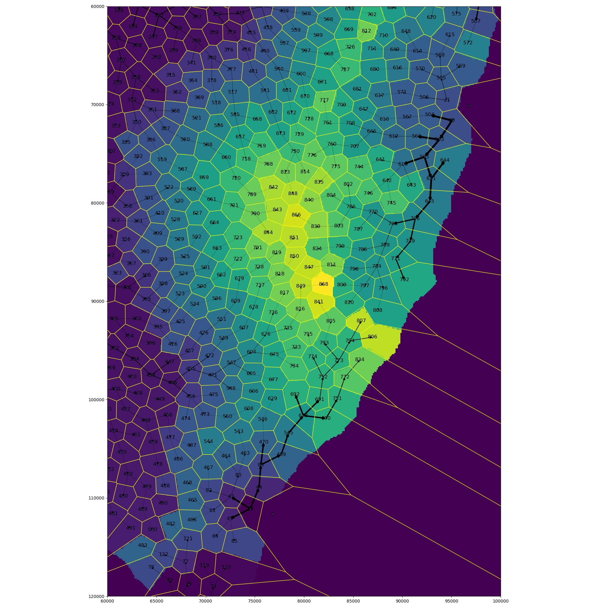

# terrainHydrology

This is a terrain generator inspired by 2013 paper "Terrain Generation Using Procedural Models Based on Hydrology".


## About

Most ontogenetic approaches to procedural terrain (Perlin noise, midpoint displacement, etc) produce results that, although generally better than man-made maps, are nonetheless unnatural. Real terrain contains very few local minima, and is not evenly fractal at all scales. Teleological algorithms can help, but may not be performant, especially when simulating small-scale processes over large maps.

The approach described in Genevaux et al is an ontogenetic approach that is meant to more closely approximate features of terrain on a sub-regional scale. On this scale, terrain is strongly shaped by the flow of water---even in dry landscapes. Thus, the approach of this algorithm is to generate the hydrological network first, and then generate terrain features from that. The approach is reasonably fast (or, at least, it can be) compared to an equivalent teleological approach, and the results are fairly convincing. Moreover, the user is allowed a great deal of control over the output by controlling the shoreline and the slope of rivers and the surrounding terrain.

## Usage

This project consists of three scripts: `hydrology.py`, `hydrology-render.py`, and `hydrology-visualize.py`. They are all located in the `src/` directory, and the `-h` switch will display basic options for each.

### `hydrology.py`

This script will generate terrain and stores it in a binary file. This binary file contains the full data model that can be rendered at an arbitrary resolution.

The program requires three images as inputs. They should all be the same resolution.

1. The gamma, or shoreline, should be a black-and-white image (though the actual color model does not matter). Full white `ffffff` represents land, and full black `000000` represents ocean. The program does not currently support inland seas or lakes.
1. The river slope map is a grayscale image (though the actual color model does not matter). This map indicates the slope of rivers. Lighter values represent steeper slopes, and darker values represent more level slopes.
1. The terrain slope map is also a grayscale image. It indicates the slope of terrain independent of the rivers.

Switch | Notes
------ | -----
`-g`, `--gamma` | The gamma, or shoreline
`-s`, `--river-slope` | The river slope map
`-t`, `--terrain-slope` | The terrain slope map
`-ri` | This is the spatial resolution of the input images in meters per pixel.
`--num-rivers` | This is the number of drainages to create along the coast.
`p` | This is the approximate number of terrain primitives for each cell.
`--dry-run` | Only calculate the river network and forget about anything that has to do with ridges. This is useful for designing landscapes, as it can allow for faster feedback
`--accelerate` | Accelerate Your Life™ with a natively-compiled module that can generate the river network much more quickly. (See "Native module" section below)
`-o`, `--output` | The file that will contain the data model

### `hydrology-render.py`

This script will render the terrain as a GeoTIFF and a small `.png` image. The file `out-geo.tif` is a GeoTIFF file that can be read by GIS software.

Switch | Notes
------ | -----
`-i` | The file that contains the data model you wish to render
`-ro` | This is the number of pixels or samples on each side of the output raster
`--lat` | This is the center latitude of the output GeoTIFF
`--lon` | This is the center longitude of the output GeoTIFF
`-o` | The directory in which to dump the output files

Optionally, `--num-procs` can be used to specify the number of processes to use in rendering the output raster. This will take advantage of the parallel processing capabilities of your CPU, and the number specified here should be equal to the number of cores in your CPU(s). Numbers larger than this obviously will not help, but numbers less than this may reduce performance.

### `hydrology-visualize.py`



This script will visualize certain components of the data model. This can be useful for debugging or adding new features.

The background can either be an outline of the shore, or the cells can be color coded for the Voronoi cell ID, or color coded for the height of the cell node's elevation.

The terrain primitives can be displayed as well as the interpolated paths of the rivers.

The hydrology network can be visualized. The edges can be weighted according to river flow, if desired.

Switch | Notes
------ | -----
`-xl`, `--lower-x` | x lower bound
`-yl`, `--lower-y` | y lower bound
`-xu`, `--upper-x` | x upper bound
`-yu`, `--upper-y` | y upper bound
`--river-heights` | river height cells as background
`--voronoi-cells` | voronoi cells as background
`--terrain-primitives` | show terrain primitives
`--river-paths` | show rivers
`--hydrology-network` | show hydrology network
`--hydrology-network-flow` | show hydrology network with
`-o` | The path+name of the image to write

### Example

```
src/hydrology.py -g example/in/gamma.png -s example/in/riverslope.png -t example/in/terrainslope.png -ri 100 -p 50 -o example/out/data
```

```
src/hydrology-render.py -i example/out/data --lat 43.2 --lon -103.8 -ro 500 -o example/out/
```

```
src/hydrology-visualize.py -i example/out/data -g example/in/gamma.png -xl 60000 -xu 100000 -yl 60000 -yu 120000 --river-heights --hydrology-network-flow -o example/out/visualize.jpg
```

## Documentation

Documentation for developers and "power users" can be found in the `doc` directory. Documentation is powered by Sphinx.

To generate the documentation, install Sphinx and run

> make html

or

> make pdf

For HTML documentation, you will need to install the readthedocs.org theme.

To generate PDF documentation, you will need the LaTeX toolchain.

## Native module

There is a native module that can accelerate the process of generating the river network. It uses OpenMP to generate the network in parallel, but it must be compiled. It was developed on Fedora and has been tested on Ubuntu. In the `src` directory, use `make buildRivers` to build the module, and use the `--accelerate` flag to use it.

### Dependencies for the native module

#### Libraries

To compile the module, you will need the OpenCV library and the necessary header files. On Ubuntu (and hopefully other Debian-based systems), you can use

> `apt install libopencv-dev`

On Fedora and RPM-based distributions, this command should suffice

> `dnf install opencv-devel`

You will also need OpenMP. It seems to come with Ubuntu and Fedora, but it's also widely available in package repositories.

#### Google Test

To build the test binary, you will need the Google Test repository in the `src/tst` directory. Use `git clone` to clone the `googletest` repository into `src/tst` (the repository is hosted on GitHub).

### Documentation for the native module

Documentation for the native module is powered by Doxygen. To generate the documentation, go to the `doc-native` directory and run

> `doxygen`

## General dependencies and citations

### Standard repositories

These Python dependencies should be available through most package managers.

* Scipy
* Matplotlib
* OpenCV
* Networkx
* Shapely
* tqdm
* Rasterio

NOTE: I had trouble getting Scipy to work on a fresh Ubuntu install. I fixed it by uninstalling it with `apt` and reinstalling it with `pip`.

### Poisson.py

Poisson.py is a modified version of the Possion.py in this repository:

> [https://github.com/bartwronski/PoissonSamplingGenerator](PoissonSamplingGenerator)

### Original paper

The original paper is cited as follows:

> Jean-David Genevaux, Eric Galin, Eric Guérin, Adrien Peytavie, Bedrich Benes. Terrain Generation Using Procedural Models Based on Hydrology. ACM Transactions on Graphics, Association for Computing Machinery, 2013, 4, 32, pp.143:1-143:13. ￿10.1145/2461912.2461996￿. ￿hal-01339224￿